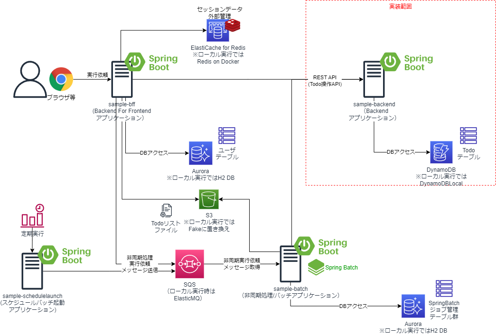

# SpringBootのBackendアプリケーションサンプル（DynamoDB版）

## 概要
* TODOを管理するREST APIを提供するSpringBootのサンプルアプリケーションである。
* TODOの取得、TODOの登録、TODOの完了、TODOの削除を行える。
* 別プロジェクト、別リポジトリで作成している、BFF(Backend For Frontend)のサンプルアプリケーション(sampe-bff)、非同期処理/バッチのサンプルアプリケーション（sample-batch）からAPIを利用している。
* 同様のサンプルアプリのリポジトリ「sample-backend」では、データストアとしてRDBを使用しているが、DynamoDBに置き換えたサンプルとしている。


## プロジェクト構成
* sample-bff
    * 別のプロジェクト。当該名称のリポジトリを参照のこと。Spring BootのWebブラウザアプリケーション（Backend for Frontend）で、ユーザがログイン後、TODOやユーザを管理する画面を提供する。また、画面やAPIからsample-batchへの非同期実行依頼も可能である。
        * デフォルトでは「spring.profiles.active」プロパティが「dev」になっている。プロファイルdevの場合は、RDB続化にはH2DBによる組み込みDB、セッション外部化は無効化、SQS接続はsample-batch側で組み込みで起動するElasticMQへ送信するようになっている。
        * プロファイルproductionの場合は、RDB永続化にはPostgreSQL(AWS上はAurora等）、セッション外部化はRedis(ローカル時はRedis on Docker、AWS上はElastiCache for Redis)、SQS接続はSQSへ送信するようになっている。
* sample-backend（またはsample-backend-dynamodb)
    * 本プロジェクト。Spring BootのREST APIアプリケーションで、sample-webやsample-batchが送信したREST APIのメッセージを受信し処理することが可能である。
        * sample-backendは永続化にRDBを使っているが、sample-backend-dynamodbは同じAPのDynamoDB版になっている。
        * デフォルトでは「spring.profiles.active」プロパティが「dev」になっている。プロファイルdevの場合は、RDB永続化にはH2DBによる組み込みDBになっている。また、sample-backend-dynamodbプロジェクトの場合は、AP起動時にDynamoDBの代わりに、DynamoDB Localを組み込みで起動し、接続するようになっている。
        * プロファイルproductionの場合は、RDB永続化にはPostgreSQL(AWS上はAurora等）になっている。また、sample-backend-dynamodbプロジェクトの場合は、DynamoDBに接続するようになっている。
* sample-batch
    * 別プロジェクト。当該名称のリポジトリを参照のこと。Spring JMSを使ったSpring Bootの非同期処理アプリケーションで、sample-webやsample-schedulelaunchが送信した非同期実行依頼のメッセージをSQSを介して受信し処理することが可能である。
        * デフォルトでは「spring.profiles.active」プロパティが「dev」になっている。プロファイルdevの場合は、AP起動時にSQSの代わりにElasticMQを組み込みで起動し、リッスンするようになっている。また、RDB永続化にはH2DBによる組み込みDBになっている。
        * プロファイルproductionの場合は、SQSをリッスンするようになっている。また、RDB永続化にはPostgreSQL(AWS上はAurora等）になっている。
* sample-schedulelaunch
    * 別プロジェクト。当該名称のリポジトリを参照のこと。SpringBootのCLIアプリケーションで、実行時に引数または環境変数で指定したスケジュール起動バッチ定義IDに対応するジョブの非同期実行依頼を実施し、SQSを介して、sample-batchアプリケーションのジョブを実行する。スケジュールによるバッチ起動を想定したアプリケーション。
        * デフォルトでは「spring.profiles.active」プロパティが「dev」になっている。プロファイルdevの場合は、SQS接続はsample-batch側で組み込みで起動するElasticMQへ送信するようになっている。
        * プロファイルproductionの場合は、SQS接続はSQSへ送信するようになっている。        

# REST API一覧
* todoテーブルで管理しているデータを操作するためのREST APIを作成している
* APIを以下に示す。
    * パス内に含まれている{todoId}は、TodoリソースのIdを示すパス変数
    
    | API名 | HTTPメソッド | パス | ステータスコード | 説明 |
    | ---- | ---- | ---- | ---- | --- |
    | Todo一覧の取得 | GET | /api/v1/todos | 200(OK) | Todoリソースを全件取得する。 |
    | Todoの取得 | GET | /api/v1/todos/{todoId} | 200(OK) | Todoリソースを一件取得する。
    | Todoの登録 | POST | /api/v1/todos | 201(Created) | Todoリソースを新規作成する。 |
    | Todoの登録(バッチAP用) | POST | /api/v1/todos/batch | 201(Created) | Todoリソースを新規作成する。バッチAP用に未完了のTODOを6件以上登録できないチェックを外している。 |
    | Todoの完了 | PUT  | /api/v1/todos/{todoId} | 200(OK) | Todoリソースを完了状態に更新する。 |
    | Todoの削除 | DELETE | /api/v1/todos/{todoId} | 204(No Content) | Todoリソースを削除する。 |

## 事前準備
* 以下のライブラリを用いているので、EclipseのようなIDEを利用する場合には、プラグインのインストールが必要
    * [Lombok](https://projectlombok.org/)
        * [Eclipseへのプラグインインストール](https://projectlombok.org/setup/eclipse)
        * [IntelliJへのプラグインインストール](https://projectlombok.org/setup/intellij)
    * [Mapstruct](https://mapstruct.org/)
        * [EclipseやIntelliJへのプラグインインストール](https://mapstruct.org/documentation/ide-support/)
* DynamoDBLocalのテーブルアイテムの確認に、dynamodb-adminを使うと便利である。
    * [dynamodb-admin](https://github.com/aaronshaf/dynamodb-admin)
        * [dynamodb-adminのインストール＆起動方法](https://github.com/aaronshaf/dynamodb-admin#use-as-globally-installed-app)
        * 起動方法
            * Profile「dev」の場合、DynamoDBLocalが起動するようになっている
            * この時、DynamoDBローカルのテーブルの状況を確認する際にdynamodb-adminを以下のように起動すればよい。
        ```sh
        set DYNAMO_ENDPOINT=http://localhost:18000
        dynamodb-admin
        ```

## EclipseやIntelliJ等での動作確認
* APIの動作確認のため、PostmanやTarend REST ClientのようなREST APIクライントツールが必要
    * [Postman API Client](https://www.postman.com/product/api-client/)
    * [Tarend REST Client(DHC REST Client)](https://chrome.google.com/webstore/detail/talend-api-tester-free-ed/aejoelaoggembcahagimdiliamlcdmfm)

* ブラウザまたは、REST APIクライアントツールを使って、ヘルスチェックポイントエンドポイントをAPIを呼び出す。ローカル実行の場合8000でポートで起動する。
    * GET http://localhost:8000/actuator/health
        * 正常に起動していれば、以下返却する。        
        ```json
        {
            status: "UP"
        }    
        ``` 
* REST APIクライアントツールを使って、APIを呼び出す。
    * TODOの登録1
        * POST http://localhost:8000/api/v1/todos
        * BODY 
        ```json
        {
            "todo_title": "Hello World!"
        }        
        ```
        * HTTPステータス201で返却 
    * TODOの登録2
        * POST http://localhost:8000/api/v1/todos
        * BODY 
        ```json
        {
            "todo_title": "Good Afternoon!"
        }        
        ```
    * TODO一覧の取得
        * GET http://localhost:8000/api/v1/todos
        * HTTPステータス200で2件取得できる

    * TODO一件取得
        * GET http://localhost:8000/api/v1/todos/(TodoId)    
            * 登録時、一覧取得の応答を確認して、URLの（TodoId)を設定
        * HTTPステータス200で該当のTODOを取得できる
    * TODOの完了
        * PUT http://localhost:8000/api/v1/todos/(TodoId)    
        * HTTPステータス200で該当のTODOのfinishedプロパティがtrueになる
    * TODOの削除
        * DELETE http://localhost:8000/api/v1/todos/(TodoId)   
        * HTTPステータス204で返却
    * TODO一覧の取得
        * GET http://localhost:8000/api/v1/todos/(TodoId)    
        * HTTPステータス200で1件取得できる
    * TODOを6件以上登録する
        * HTTPステータス400でエラーレスポンスを返却
        ```json
        {
            "code": "w.ex.2002",
            "message": "5件以上のTodoが未完了のため新しいTodoは作成できません。"
        }    
        ```
    * 完了済のTODOを再度完了する
        * HTTPステータス400でエラーレスポンスを返却
        ```json
        {
            "code": "w.ex.2003",
            "message": "Todo(ID=670f32da-021a-46c0-9871-99b8d9c8b149)はすでに完了しています。"
        }
        ```
    * 存在しないIDのTODOを取得または削除する
        * HTTPステータス400でエラーレスポンスを返却
        ```json
        {
          "code": "w.ex.2001",
          "message": "対象のTodoがありません。"
        }        
        ```        

## OpenAPI
* Springdoc-openapiにより、RestControllerの実装からAPIドキュメントをリバースエンジニアリングできる
    * アプリケーションを起動し、以下のURLへアクセスするとそれぞれjson、yaml、html形式のドキュメントを表示する。
    * http://localhost:8000/v3/api-docs
        * json形式のドキュメント
    * http://localhost:8000/v3/api-docs.yaml    
        * yaml形式のドキュメント
    * http://localhost:8000/swagger-ui.html
        * html形式（Swagger-UI）のドキュメント

## AWS DynamoDBと連携したAP動作確認
* デフォルトでは、「spring.profiles.active」プロパティが「dev」になっていて、プロファイルdevの場合、DynamoDBLocalを使用するようになっている。
* AWS上のDynamoDBにアクセスする動作に変更する場合は、例えばJVM引数を「-Dspring.profiles.active=production」に変更するか、環境変数「SPRING_PROFILES_ACTIVE=prod」を設定する等して実行する。
* AP実行時に、DynamoDBにTodoテーブルがない場合には、テーブル作成するようになっている。
    * APからは自動的に削除しないので、AWSの無駄な利用料金がかからないよう、動作確認後不要になった時点でTodoテーブルの削除を忘れないようにすること。
* APがDynamoDBにアクセスする権限が必要なので、開発端末上での実行する場合はDynamoDBのアクセス権限をもったIAMユーザのクレデンシャル情報が「%USERPROFILE%/.aws/credentials」や「~/.aws/credentials」に格納されている、もしくはEC2やECS等のAWS上のラインタイム環境で実行する場合は対象のAWSリソースにDynamoDBのアクセス権限を持ったIAMロールが付与されている必要がある。

## X-Rayデーモンのローカル起動
* Profileに「xray」を追加してSpringBootアプリケーションを実行する場合、X-Rayにトレースデータを送信するため、X-Rayデーモンを起動しておく必要がある。
* ローカルでのX-Rayデーモンの起動方法は以下を参照すること。
    * デーモンのダウンロード    
        * https://docs.aws.amazon.com/ja_jp/xray/latest/devguide/xray-daemon.html
    * デーモンのローカル実行
        * https://docs.aws.amazon.com/ja_jp/xray/latest/devguide/xray-daemon-local.html

## ソフトウェアフレームワーク
* 本サンプルアプリケーションでは、ソフトウェアフレームワーク実装例も同梱している。簡単のため、アプリケーションと同じプロジェクトでソース管理している。
* ソースコードはcom.example.fwパッケージ配下に格納されている。    
    * 本格的な開発を実施する場合には、業務アプリケーションと別のGitリポジトリとして管理し、CodeArtifactやSonatype NEXUSといったライブラリリポジトリサーバでjarを管理し、pom.xmlから参照するようにすべきであるし、テストやCI/CD等もちゃんとすべきであるが、ここでは、あえて同じプロジェクトに格納してノウハウを簡単に参考にしてもらいやすいようにしている。
* 各機能と実現方式は、以下の通り。
    * RDB版サンプルAPの「sample-backend」とは、DBがDynamoDBに変わったことに関する機能のみ差異がある。

| 分類 | 機能 | 機能概要と実現方式 | 拡張実装 | 拡張実装の格納パッケージ |
| ---- | ---- | ---- | ---- | ---- |
| オンライン | オンラインAP制御 | SpringMVCの機能を利用し、ユーザからの要求受信、ビジネスロジック実行、応答返却まで一連の定型的な処理を実行を制御する。 | - | - |
|  | 認証・認可| Spring Securityを利用し、DBで管理するユーザ情報をもとに認証、認可を行う。 | - | - |
| | 集約例外ハンドリング | SpringMVCのControllerAdviceやAOPを利用し、エラー（例外）発生時、エラーログの出力、DBのロールバック、エラー画面やエラー電文の返却といった共通的なエラーハンドリングを実施する。 | ○ | com.example.fw.web.aspect |
| | 分散トレーシング（X-Ray） | AWS X-Rayを利用して、サービス間の分散トレーシング・可視化を実現する。 | ○ | com.example.fw.web.aspect<br/>com.example.fw.servlet<br/>com.example.fw.common.async<br/>com.example.fw.common.dynamodb<br/>com.example.fw.common.httpclient<br/>com.example.fw.common.objectstorage |
| | ヘルスチェック | Spring Boot Actuatorを利用して、ヘルスチェックエンドポイントを提供する。その他、Micrometerメトリックの情報提供も行う。 | - | - |
| | グレースフルシャットダウン | SpringBootの機能で、Webサーバ（組み込みTomcat）のグレースフルシャットダウン機能を提供する 。 | - | - |
| | Open APIドキュメント生成 | Springdoc-openapiの機能で、RestController等の実装、アノテーション情報からOpen APIドキュメントをjson、yaml、html（Swagger-UI）形式を提供する 。 | - | - |
| オン・バッチ共通 | DynamoDBアクセス | AWS SDK for Java 2.xのDynamoDB拡張クライアント（DynamoDbEnhancedClient)を使って、DBへのアクセス機能を提供する。 | ○ | com.example.fw.common.dynamodb |
| | HTTPクライアント | WebClientやRestTemplateを利用してREST APIの呼び出しやサーバエラー時の例外の取り扱いを制御する。 | ○ | com.example.fw.common.httpclient |
| | リトライ・サーキットブレーカ | Spring Cloud Circuit Breaker（Resillience4j）を利用し、REST APIの呼び出しでの一時的な障害に対する遮断やフォールバック処理等を制御する。また、WebClientのリトライ機能でエクスポネンシャルバックオフによりリトライを実現する。なお、AWSリソースのAPI呼び出しは、AWS SDKにてエクスポネンシャルバックオフによりリトライ処理を提供。 | - | - |
| | 分散トレーシング | Micrometer Tracingを利用して、トレースIDやスパンIDをAP間でのREST API呼び出しで引継ぎログに記録することで、分散トレーシングを実現する。 | - | - |
| | 非同期実行依頼 | Spring JMS、Amazon SQS Java Messaging Libraryを利用し、SQSの標準キューを介した非同期実行依頼のメッセージを送信する。 | ○ | com.example.fw.common.async |
| | 入力チェック| Java BeanValidationとSpringのValidation機能を利用し、単項目チェックや相関項目チェックといった画面の入力項目に対する形式的なチェックを実施する。 | ○ | com.example.fw.common.validation |
| | メッセージ管理 | MessageResourceで画面やログに出力するメッセージを管理する。 | ○ | com.example.fw.common.message |
| | 例外 | RuntimeExceptionを継承し、エラーコード（メッセージID）やメッセージを管理可能な共通的なビジネス例外、システム例外を提供する。 | ○ | com.example.fw.common.exception |
| | ロギング | Slf4jとLogback、SpringBootのLogback拡張の機能を利用し、プロファイルによって動作環境に応じたログレベルや出力先（ファイルや標準出力）、出力形式（タブ区切りやJSON）に切替可能とする。またメッセージIDをもとにログ出力可能な汎用的なAPIを提供する。 | ○ | com.example.fw.common.logging |
| | プロパティ管理 | SpringBootのプロパティ管理を使用して、APから環境依存のパラメータを切り出し、プロファイルによって動作環境に応じたパラメータ値に置き換え可能とする。 | - | - |
| | オブジェクトマッピング | MapStructを利用し、類似のプロパティを持つリソースオブジェクトやDTOとドメインオブジェクト間で、値のコピーやデータ変換処理を簡単にかつ高速に行えるようにする。 | - | - |
| | DI | Springを利用し、DI（依存性の注入）機能を提供する。 | - | - |
| | AOP | SpringとAspectJAOPを利用し、AOP機能を提供する。 | - | - |
| | ボイラープレートコード排除 | Lombokを利用し、オブジェクトのコンストラクタやGetter/Setter等のソースコードを自動生成し、ボイラープレートコードを排除する。 | - | - |

* 以下は、今後追加適用を検討中。

| 分類 | 機能 | 機能概要と実現方式 | 拡張実装 | 拡張実装の格納パッケージ |
| ---- | ---- | ---- | ---- | ---- |
| オンライン | OIDC認証 | Spring Securityの機能でOIDCの認証を行う。 | - | - |
| オン・バッチ共通 | | プロパティ管理（SSM） | Spring Cloud for AWS機能により、APから環境依存のパラメータをAWSのSSMパラメータストアに切り出し、プロファイルによって動作環境に応じたパラメータ値に置き換え可能とする。 | - | - |
| | テストコード作成支援 | JUnit、Mockito、Springのテスト機能を利用して、単体テストコードや結合テストコードの実装を支援する機能を提供する。 | - | - |