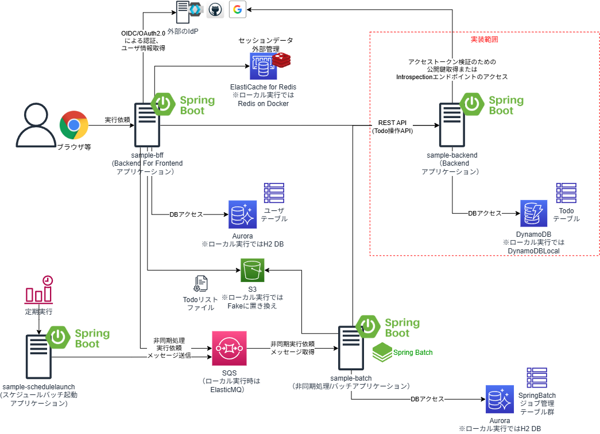
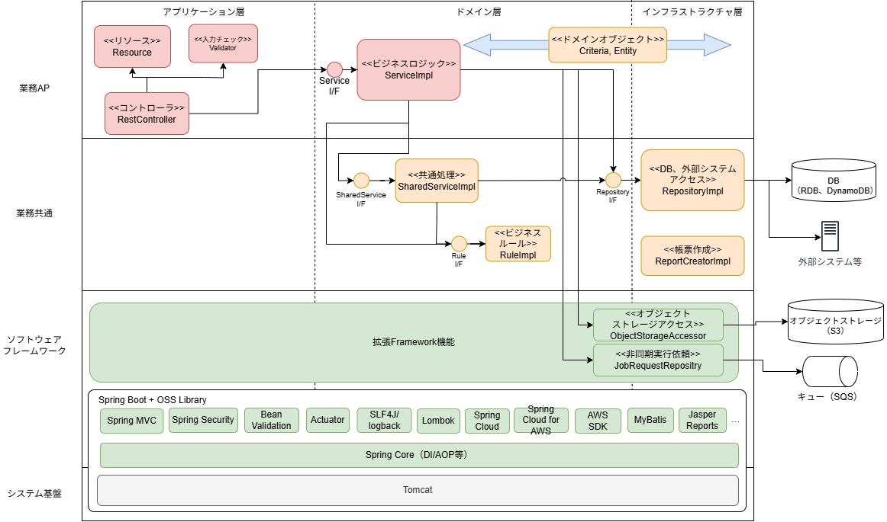

# SpringBootのBackendアプリケーションサンプル（DynamoDB版）

## 1. 概要
* TODOを管理するREST APIを提供するSpringBootのサンプルアプリケーションである。
* TODOの取得、TODOの登録、TODOの完了、TODOの削除を行える。
* 別プロジェクト、別リポジトリで作成している、BFF(Backend For Frontend)のサンプルアプリケーション(sampe-bff)、非同期処理/バッチのサンプルアプリケーション（sample-batch）からAPIを利用している。
* 同様のサンプルアプリのリポジトリ「sample-backend」では、データストアとしてRDBを使用しているが、DynamoDBに置き換えたサンプルとしている。


* 本サンプルAPのソフトウェアアーキテクチャの図は以下の通り。



## 2. プロジェクト構成
* [sample-bff](https://github.com/mysd33/sample-bff)
    * 別プロジェクト。当該名称のリポジトリを参照のこと。Spring BootのWebブラウザアプリケーション（Backend for Frontend）で、ユーザがログイン後、TODOやユーザを管理する画面を提供する。また、画面やAPIからsample-batchへの非同期実行依頼も可能である。
        * デフォルトでは「spring.profiles.active」プロパティが「dev」になっている。プロファイルdevの場合は、RDB永続化にはH2DBによる組み込みDB、セッション外部化は無効化、SQS接続はsample-batch側で組み込みで起動するElasticMQへ送信するようになっている。
        * プロファイルproductionの場合は、RDB永続化にはPostgreSQL(AWS上はAurora等）、セッション外部化はRedis(ローカル時はRedis on Docker、AWS上はElastiCache for Redis)、SQS接続はSQSへ送信するようになっている。
* [sample-backend](https://github.com/mysd33/sample-backend)（または[sample-backend-dynamodb](https://github.com/mysd33/sample-backend-dynamodb)）
    * 本プロジェクト。Spring BootのREST APIアプリケーションで、sample-webやsample-batchが送信したREST APIのメッセージを受信し処理することが可能である。
        * sample-backendは永続化にRDBを使っているが、sample-backend-dynamodbは同じAPのDynamoDB版になっている。
        * デフォルトでは「spring.profiles.active」プロパティが「dev」になっている。プロファイルdevの場合は、RDB永続化にはH2DBによる組み込みDBになっている。また、sample-backend-dynamodbプロジェクトの場合は、AP起動時にDynamoDBの代わりに、DynamoDB Localを組み込みで起動し、接続するようになっている。
        * プロファイルproductionの場合は、RDB永続化にはPostgreSQL(AWS上はAurora等）になっている。また、sample-backend-dynamodbプロジェクトの場合は、DynamoDBに接続するようになっている。
* [sample-batch](https://github.com/mysd33/sample-batch)
    * 別プロジェクト。当該名称のリポジトリを参照のこと。Spring JMSを使ったSpring Bootの非同期処理アプリケーションで、sample-webやsample-schedulelaunchが送信した非同期実行依頼のメッセージをSQSを介して受信し処理することが可能である。
        * デフォルトでは「spring.profiles.active」プロパティが「dev」になっている。プロファイルdevの場合は、AP起動時にSQSの代わりにElasticMQを組み込みで起動し、リッスンするようになっている。また、RDB永続化にはH2DBによる組み込みDBになっている。
        * プロファイルproductionの場合は、SQSをリッスンするようになっている。また、RDB永続化にはPostgreSQL(AWS上はAurora等）になっている。
* [sample-schedulelaunch](https://github.com/mysd33/sample-schedulelaunch)
    * 別プロジェクト。当該名称のリポジトリを参照のこと。SpringBootのCLIアプリケーションで、実行時に引数または環境変数で指定したスケジュール起動バッチ定義IDに対応するジョブの非同期実行依頼を実施し、SQSを介して、sample-batchアプリケーションのジョブを実行する。スケジュールによるバッチ起動を想定したアプリケーション。
        * デフォルトでは「spring.profiles.active」プロパティが「dev」になっている。プロファイルdevの場合は、SQS接続はsample-batch側で組み込みで起動するElasticMQへ送信するようになっている。
        * プロファイルproductionの場合は、SQS接続はSQSへ送信するようになっている。

* その他、本APとは連携しないので図に掲載がないが、StepFunctionsのステートマシンを使用してジョブの実行順序制御を行うバッチAPのサンプルプロジェクトとして以下があるので、参考にするとよい。
    * [sample-batch-jobflow](https://github.com/mysd33/sample-batch-jobflow)

## 3. REST API一覧
* todoテーブルで管理しているデータを操作するためのREST APIを作成している
* APIを以下に示す。
    * パス内に含まれている{todoId}は、TodoリソースのIdを示すパス変数
    
* v1のAPI一覧（Basic認証によるAPI）
    | API名 | HTTPメソッド | パス | ステータスコード | 説明 |
    | ---- | ---- | ---- | ---- | --- |
    | Todo一覧の取得 | GET | /api/v1/todos | 200(OK) | Todoリソースを全件取得する。 |
    | Todoの取得 | GET | /api/v1/todos/{todoId} | 200(OK) | Todoリソースを一件取得する。
    | Todoの登録 | POST | /api/v1/todos | 201(Created) | Todoリソースを新規作成する。 |
    | Todoの登録(バッチAP用) | POST | /api/v1/todos/batch | 201(Created) | Todoリソースを新規作成する。バッチAP用に未完了のTODOを6件以上登録できないチェックを外している。 |
    | Todoの完了 | PUT  | /api/v1/todos/{todoId} | 200(OK) | Todoリソースを完了状態に更新する。 |
    | Todoの削除 | DELETE | /api/v1/todos/{todoId} | 204(No Content) | Todoリソースを削除する。 |

* v2のAPI一覧（OAuthによるAPI認可が必要なAPI）
    | API名 | HTTPメソッド | パス | ステータスコード | 説明 |
    | ---- | ---- | ---- | ---- | --- |
    | Todo一覧の取得 | GET | /api/v2/todos | 200(OK) | Todoリソースを全件取得する。 |
    | Todoの取得 | GET | /api/v2/todos/{todoId} | 200(OK) | Todoリソースを一件取得する。
    | Todoの登録 | POST | /api/v2/todos | 201(Created) | Todoリソースを新規作成する。 |
    | Todoの登録(バッチAP用) | POST | /api/v2/todos/batch | 201(Created) | Todoリソースを新規作成する。バッチAP用に未完了のTODOを6件以上登録できないチェックを外している。 |
    | Todoの完了 | PUT  | /api/v2/todos/{todoId} | 200(OK) | Todoリソースを完了状態に更新する。 |
    | Todoの削除 | DELETE | /api/v2/todos/{todoId} | 204(No Content) | Todoリソースを削除する。 |

## 4. 事前準備
* 以下のライブラリを用いているので、EclipseやIntelliJのようなIDEを利用する場合には、プラグインのインストールが必要
    * [Lombok](https://projectlombok.org/)
        * [Eclipseへのプラグインインストール](https://projectlombok.org/setup/eclipse)
        * [IntelliJへのプラグインインストール](https://projectlombok.org/setup/intellij)
    * [Mapstruct](https://mapstruct.org/)
        * [EclipseやIntelliJへのプラグインインストール](https://mapstruct.org/documentation/ide-support/)

## 5. IDEでのアプリ起動
* EclipseやIntelliJ等のIDEで、Spring Bootアプリケーションを起動する。
    1. Backend AP（sample-backend-dynamodb）の起動
        * sample-backend-dynamodbをSpringBoot Applicationとして起動。
    2. Web AP（sample-bff）の起動
        * sample-bffをSpringBoot Applicationとして起動。
    3. 非同期AP（sample-batch）の起動
        * sample-batchをSpringBoot Applicationとして起動。

* Profile「dev」の場合、DynamoDBLocalが起動するようになっている。DynamoDB Localのテーブルアイテムの確認に、dynamodb-adminまたはNoSQL Workbenchを使うと便利である。    
    * [dynamodb-admin](https://github.com/aaronshaf/dynamodb-admin)
        * [dynamodb-adminのインストール＆起動方法](https://github.com/aaronshaf/dynamodb-admin#use-as-globally-installed-app)
        * 起動方法            
            * dynamodb-adminを以下のように起動する
        ```sh
        set DYNAMO_ENDPOINT=http://localhost:18000
        dynamodb-admin
        ```
    * [NoSQL Workbench](https://docs.aws.amazon.com/ja_jp/amazondynamodb/latest/developerguide/workbench.settingup.html)
        * DynamoDB Localへの接続方法
            * 「Operation builder」の画面で「+Add connection」ボタンをクリック
            * 「DynamoDB local」を選択し、Portを18000に設定し、「Connect」ボタンをクリック

* APIの動作確認のため、PostmanやTarend REST ClientのようなREST APIクライントツールが必要
    * [Postman API Client](https://www.postman.com/product/api-client/)
    * [Tarend REST Client(DHC REST Client)](https://chrome.google.com/webstore/detail/talend-api-tester-free-ed/aejoelaoggembcahagimdiliamlcdmfm)

* ブラウザまたは、REST APIクライアントツールを使って、ヘルスチェックポイントエンドポイントをAPIを呼び出す。ローカル実行の場合8000でポートで起動する。
    * GET http://localhost:8000/actuator/health
        * 正常に起動していれば、以下返却する。        
        ```json
        {
            status: "UP"
        }    
        ``` 
* REST APIクライアントツールを使って、V1のAPIを呼び出す。
    * クライアントツールを使うときには、Basic認証のユーザ名とパスワードを設定する必要がある。  
    * デフォルトの設定の場合は以下
        * ユーザ名: systemuser
        * パスワード: password

    * TODOの登録1
        * POST http://localhost:8000/api/v1/todos
        * BODY 
        ```json
        {
            "todo_title": "Hello World!"
        }        
        ```
        * HTTPステータス201で返却 
    * TODOの登録2
        * POST http://localhost:8000/api/v1/todos
        * BODY 
        ```json
        {
            "todo_title": "Good Afternoon!"
        }        
        ```
    * TODO一覧の取得
        * GET http://localhost:8000/api/v1/todos
        * HTTPステータス200で2件取得できる

    * TODO一件取得
        * GET http://localhost:8000/api/v1/todos/(TodoId)    
            * 登録時、一覧取得の応答を確認して、URLの（TodoId)を設定
        * HTTPステータス200で該当のTODOを取得できる
    * TODOの完了
        * PUT http://localhost:8000/api/v1/todos/(TodoId)    
        * HTTPステータス200で該当のTODOのfinishedプロパティがtrueになる
    * TODOの削除
        * DELETE http://localhost:8000/api/v1/todos/(TodoId)   
        * HTTPステータス204で返却
    * TODO一覧の取得
        * GET http://localhost:8000/api/v1/todos/(TodoId)    
        * HTTPステータス200で1件取得できる
    * TODOを6件以上登録する
        * HTTPステータス400でエラーレスポンスを返却
        ```json
        {
            "code": "w.ex.2002",
            "message": "5件以上のTodoが未完了のため新しいTodoは作成できません。"
        }    
        ```
    * 完了済のTODOを再度完了する
        * HTTPステータス400でエラーレスポンスを返却
        ```json
        {
            "code": "w.ex.2003",
            "message": "Todo(ID=670f32da-021a-46c0-9871-99b8d9c8b149)はすでに完了しています。"
        }
        ```
    * 存在しないIDのTODOを取得または削除する
        * HTTPステータス400でエラーレスポンスを返却
        ```json
        {
          "code": "w.ex.2001",
          "message": "対象のTodoがありません。"
        }        
        ```

## 6. OIDC認証・認可
> [!WARNING]
> 昔に作成した[サンプルコード](https://github.com/mysd33/sample-springsecurity-oauth2)を最新のSpring Bootに対応しつつ、ただいま実装中。  
> 現状、端末ローカル実行での起動時（devプロファイル）のみに対応。AWS実行時の本番環境相当のプロファイル（production）は今後対応予定。

* Spring Security OAuth2.0 Resource Serverを利用して、OIDC/OAuth2.0によるAPI認可を実装する。
* V2のAPIは、OAuth2.0による認可が必要なAPIであるので、sample-bffのアプリから呼び出して動作確認するとよい。
    * BFFアプリケーションでKeycloakによるOIDC認証・認可を実施し、アクセストークンを取得する。
        * OAuth2.0によるv2のAPI呼び出しはKeycloakでのログイン時のみで、認証およびGoogle,GitHubでの認証は、v1のBasic認証による呼び出しになるので注意。
    * 取得したアクセストークンをV2のAPI呼び出し時にAuthorizationヘッダに付与して呼び出す。
    * 本アプリケーション（Backendアプリケーション）では、Resource Serverとして、アクセストークンによるAPI認可を実施する。
* BFFアプリケーションでのOIDCによるユーザ認証・認可および操作方法は[sample-bffプロジェクト](https://github.com/mysd33/sample-bff#7-oidc%E8%AA%8D%E8%A8%BC%E8%AA%8D%E5%8F%AF)を参照。

## 7. プロファイル「production」でのローカル実行
* 「production」に切り替えるには、例えばJVM引数を「-Dspring.profiles.active=production」に変更するか、環境変数「SPRING_PROFILES_ACTIVE=production」を設定する等で起動する。

> [!WARNING]
> 以降の手順が、最新化できていないので、今後見直し予定。

## 8. AWS DynamoDBと連携したAP動作確認
* デフォルトでは、「spring.profiles.active」プロパティが「dev」になっていて、プロファイルdevの場合、DynamoDBLocalを使用するようになっている。AP実行時に、DynamoDBにTodoテーブルがない場合には、テーブル作成するようになっている。

* Profileが「production」に切り替えてSpringBootアプリケーションを実行する場合、事前にDynamoDBを起動しておく必要がある。
    * productionの場合も、AP実行時に、DynamoDBにTodoテーブルがない場合には、テーブル作成するようになっている。
    * APからは自動的に削除しないので、AWSの無駄な利用料金がかからないよう、動作確認後不要になった時点でTodoテーブルの削除を忘れないようにすること。
    * APがDynamoDBにアクセスする権限が必要なので、開発端末上での実行する場合はDynamoDBのアクセス権限をもったIAMユーザのクレデンシャル情報が「%USERPROFILE%/.aws/credentials」や「~/.aws/credentials」に格納されている、もしくはEC2やECS等のAWS上のラインタイム環境で実行する場合は対象のAWSリソースにDynamoDBのアクセス権限を持ったIAMロールが付与されている必要がある。
* Profileが「production」でAPをローカル実行する場合には、ローカルでDockerかjar起動でDynamoDB Localを起動しておく必要がある。

> [!WARNING]
> TBD: DockerでのDynamoDB起動方法

## 9. X-Rayデーモンのローカル起動

> [!WARNING]
> X-Ray SDK/X-Rayデーモンは、AWS X-Ray 用の SDK と Daemon は2026年2月25日にメンテナンスモードに入り、2027年2月25日にサポート終了となるため、削除予定。

* Profileに「xray」を追加してSpringBootアプリケーションを実行する場合、X-Rayにトレースデータを送信するため、X-Rayデーモンを起動しておく必要がある。
* ローカルでのX-Rayデーモンの起動方法は以下を参照すること。
    * デーモンのダウンロード    
        * https://docs.aws.amazon.com/ja_jp/xray/latest/devguide/xray-daemon.html
    * デーモンのローカル実行
        * https://docs.aws.amazon.com/ja_jp/xray/latest/devguide/xray-daemon-local.html

## 10. Dockerでのアプリ起動

> [!WARNING]
> 以降の手順が、最新化できていないので、今後見直し予定。

* Mavenビルド
```sh
#Windows
.\mvnw.cmd package
#Linux/Mac
./mvnw package
```

### 10.1. ローカルでDocker実行（Profileを「dev」でSpringBoot実行）の場合

* ローカルでDockerビルド
```sh
docker build -t XXXXXXXXXXXX.dkr.ecr.ap-northeast-1.amazonaws.com/sample-backend:latest .
```

* ローカルでDocker実行（Profileを「dev」でSpringBoot実行する場合）
```sh
docker run -d -p 8000:8000 --name samplebackend --env SPRING_PROFILES_ACTIVE=dev,log_default XXXXXXXXXXXX.dkr.ecr.ap-northeast-1.amazonaws.com/sample-backend:latest

#logをjson形式に変更する場合
docker run -d -p 8000:8000 --name samplebackend --env SPRING_PROFILES_ACTIVE=dev,log_container XXXXXXXXXXXX.dkr.ecr.ap-northeast-1.amazonaws.com/sample-backend:latest
```

### 10.2. ローカルでDocker実行（Profileを「production」でSpringBoot実行）　の場合

* ローカルでDocker実行（Profileを「production」でSpringBoot実行する場合）
    * ※Redisのローカル起動、PostgreSQLのローカル起動も必要
```sh
docker run -d -p 8000:8000 --name samplebackend --env SPRING_PROFILES_ACTIVE=production,log_default --env SERVER_PORT=8000 --env SPRING_DATASOURCE_URL=jdbc:postgresql://host.docker.internal:5432/testdb XXXXXXXXXXXX.dkr.ecr.ap-northeast-1.amazonaws.com/sample-backend:latest

#logをjson形式に変更する場合
docker run -d -p 8000:8000 --name samplebackend --env SPRING_PROFILES_ACTIVE=production,log_container --env SERVER_PORT=8000 --env SPRING_DATASOURCE_URL=jdbc:postgresql://host.docker.internal:5432/testdb XXXXXXXXXXXX.dkr.ecr.ap-northeast-1.amazonaws.com/sample-backend:latest
```

## 11. ECRプッシュ
* AWS上でECSやEKS等で動作させる場合は、事前にECRへDockerイメージをプッシュしておく必要がある。

```sh
aws ecr get-login-password --region ap-northeast-1 | docker login --username AWS --password-stdin XXXXXXXXXXXX.dkr.ecr.ap-northeast-1.amazonaws.com
docker push XXXXXXXXXXXX.dkr.ecr.ap-northeast-1.amazonaws.com/sample-backend:latest
```

## 12. AWS上でのアプリ起動
* SpringBoot APをECS/Fargate等で動作させる場合は、[ecs-on-fargate-adot-cfn-demo](https://github.com/mysd33/ecs-on-fargate-adot-cfn-demo)を参照する。

## 13. OpenAPI
* Springdoc-openapiにより、RestControllerの実装からAPIドキュメントをリバースエンジニアリングできる
    * アプリケーションを起動し、以下のURLへアクセスするとそれぞれjson、yaml、html形式のドキュメントを表示する。
    * http://localhost:8000/v3/api-docs
        * json形式のドキュメント
    * http://localhost:8000/v3/api-docs.yaml    
        * yaml形式のドキュメント
    * http://localhost:8000/swagger-ui.html
        * html形式（Swagger-UI）のドキュメント

## 14. logback-access対応によるTomcatアクセスログ
* Spring BootのデフォルトのTomcatアクセスログは、ログファイルに出力される形式であるが、logback-accessを利用することで標準出力に出力できるので、APログと一緒に、クラウド・コンテナ実行時にCloudWatch Logsへ転送することができる。

* 開発端末上では、通常のテキスト形式で出力

```
[Tomcat] 127.0.0.1 127.0.0.1 - [2025-02-02T20:31:16.424+09:00] "GET /api/v1/todos HTTP/1.1" "262 ms" 200 "null" "localhost" "tomcat-handler-0" "-" "ReactorNetty/1.1.24"
```

* クラウド上（log_containerプロファイル）では、JSON形式で出力
    * X-AMZN-TRACE-IDヘッダーの値をログに出力することで、APログ側とリクエストを紐づけできるようにしている。

    * APログの例
        ```json
        {
            "@timestamp": "2025-02-02T22:15:01.870668662+09:00",
            "@version": "1",
            "message": "RestController開始: List com.example.backend.app.api.todo.TodoRestController.getTodos(), システム日時:2025-02-02T22:15:01.776268361+09:00[Asia/Tokyo]",
            "logger_name": "com.example.fw.web.aspect.LogAspect",
            "thread_name": "tomcat-handler-30",
            "level": "INFO",
            "level_value": 20000,
            "traceId": "679f6fd5e9b727ec710a844f4cddbcb6",
            "spanId": "da75889772444b2b",
            "x_amzn_trace_id": "Self=1-679f6fd5-1432886c7e273d71356c0314;Root=1-679f6fd5-752842f73e9f1e6923beec17;Parent=393bd1b8af9ef3c0;Sampled=1"
        }
        ```

    * APログと対応するリクエストのTomcatアクセスログの例

        ```json
        {
            "type": "tomcat access log",
            "@timestamp": "2025-02-02T22:15:02.480+09:00",
            "remote_host": "10.0.2.44",
            "remote_ip": "10.0.2.44",
            "x_forwared_for": "10.0.3.249",
            "request_url": "GET /api/v1/todos HTTP/1.1",
            "http_status": "200",
            "elapsed_time": "792 ms",
            "session_id": "null",
            "session_id_on_aws": "-",
            "server_name": "internal-demo-privatealb-254582377.ap-northeast-1.elb.amazonaws.com",
            "thread_name": "tomcat-handler-30",
            "x_amzn_trace_id": "Self=1-679f6fd5-1432886c7e273d71356c0314;Root=1-679f6fd5-752842f73e9f1e6923beec17;Parent=393bd1b8af9ef3c0;Sampled=1",
            "user_agent": "ReactorNetty/1.1.24"
        }
        ```

## 15. ソフトウェアフレームワーク
* 本サンプルアプリケーションでは、ソフトウェアフレームワーク実装例も同梱している。簡単のため、アプリケーションと同じプロジェクトでソース管理している。
* ソースコードはcom.example.fwパッケージ配下に格納されている。    
    * 本格的な開発を実施する場合には、業務アプリケーションと別のGitリポジトリとして管理し、CodeArtifactやSonatype NEXUSといったライブラリリポジトリサーバでjarを管理し、pom.xmlから参照するようにすべきであるし、テストやCI/CD等もちゃんとすべきであるが、ここでは、あえて同じプロジェクトに格納してノウハウを簡単に参考にしてもらいやすいようにしている。
* 各機能と実現方式は、以下の通り。
    * RDB版サンプルAPの「sample-backend」とは、DBがDynamoDBに変わったことに関する機能のみ差異がある。

| 分類 | 機能 | 機能概要と実現方式 | 拡張実装 | 拡張実装の格納パッケージ |
| ---- | ---- | ---- | ---- | ---- |
| オンライン | オンラインAP制御 | SpringMVCの機能を利用し、ユーザからの要求受信、ビジネスロジック実行、応答返却まで一連の定型的な処理を実行を制御する。 | - | - |
| | ユーザ認証・認可（フォーム認証） | Spring Securityを利用し、DBで管理するユーザ情報をもとにフォーム認証、認可を行う。 | - | - |
| | ユーザ認証・認可（OIDC/OAuth2.0）      | Spring Security OAuth2 Clientの機能でOIDCによるユーザ認証、認可を行う。 | - | - |
| | API認可（OAuth2.0） | Spring Security OAuth2 Resource Serverの機能でバックエンドのAPIの認可を行う。 | - | - |
| | 集約例外ハンドリング | SpringMVCのControllerAdviceやAOPを利用し、エラー（例外）発生時、エラーログの出力、DBのロールバック、エラー画面やエラー電文の返却といった共通的なエラーハンドリングを実施する。 | ○ | com.example.fw.web.aspect |
| | ヘルスチェック | Spring Boot Actuatorを利用して、ヘルスチェックエンドポイントを提供する。その他、Micrometerメトリックの情報提供も行う。 | - | - |
| | グレースフルシャットダウン | SpringBootの機能で、Webサーバ（組み込みTomcat）のグレースフルシャットダウン機能を提供する 。 | - | - |
| | Open APIドキュメント生成 | Springdoc-openapiの機能で、RestController等の実装、アノテーション情報からOpen APIドキュメントをjson、yaml、html（Swagger-UI）形式を提供する 。 | - | - |
| オン・バッチ共通 | DynamoDBアクセス | AWS SDK for Java 2.xのDynamoDB拡張クライアント（DynamoDbEnhancedClient)を使って、DBへのアクセス機能を提供する。 | ○ | com.example.fw.common.dynamodb |
| | DynamoDBトランザクション管理機能 | DynamoDBのトランザクション管理機能（TransactWriteItems）を利用する操作に対して、AOP機能を利用して、@DynamoDBTransactionalアノテーションによる宣言的トランザクションを実現する機能を提供する。 | ○ | com.example.fw.common.dynamodb |
| | HTTPクライアント | WebClientやRestTemplateを利用してREST APIの呼び出しやサーバエラー時の例外の取り扱いを制御する。 | ○ | com.example.fw.common.httpclient |
| | リトライ・サーキットブレーカ | Spring Cloud Circuit Breaker（Resillience4j）を利用し、REST APIの呼び出しでの一時的な障害に対する遮断やフォールバック処理等を制御する。また、WebClientのリトライ機能でエクスポネンシャルバックオフによりリトライを実現する。なお、AWSリソースのAPI呼び出しは、AWS SDKにてエクスポネンシャルバックオフによりリトライ処理を提供。 | - | - |
| | 非同期実行依頼 | Spring JMS、Amazon SQS Java Messaging Libraryを利用し、SQSの標準キューを介した非同期実行依頼のメッセージを送信する。 | ○ | com.example.fw.common.async |
| | 入力チェック| Java BeanValidationとSpringのValidation機能を利用し、単項目チェックや相関項目チェックといった画面の入力項目に対する形式的なチェックを実施する。 | ○ | com.example.fw.common.validation |
| | メッセージ管理 | MessageResourceで画面やログに出力するメッセージを管理する。 | ○ | com.example.fw.common.message |
| | 例外 | RuntimeExceptionを継承し、エラーコード（メッセージID）やメッセージを管理可能な共通的なビジネス例外、システム例外を提供する。 | ○ | com.example.fw.common.exception |
| | ロギング | Slf4jとLogback、SpringBootのLogback拡張、ver3.4からのStructured Logs機能を利用し、プロファイルによって動作環境に応じたログレベルや出力先（ファイルや標準出力）、出力形式（タブ区切りやJSON）に切替可能とする。またメッセージIDをもとにログ出力可能な汎用的なAPIを提供する。<br/>また、logback-accessを利用しTomcatのアクセスログを出力可能とする。 | ○ | com.example.fw.common.logging<br/>com.example.fw.web.servlet |
| | 分散トレーシング（ログ） | Micrometer Tracingを利用して、トレースIDやスパンIDをAP間でのREST API呼び出しで引継ぎ、ログにも記録することを実現する。 | - | - |
| | 分散トレーシング（X-Ray） | X-Rayによるサービス間の分散トレーシング・可視化を実現する。2パターンの実装を提供している。<br>(1) AWS X-Ray SDKを利用する<br>(2)ADOT(AWS Distro for Open Telemetry)でAP側は未実装で自動計測する | ○ | com.example.fw.web.aspect<br>com.example.fw.servlet<br>com.example.fw.common.async<br>com.example.fw.common.dynamodb<br>com.example.fw.common.httpclient<br>com.example.fw.common.objectstorage <br> ※(1)の場合|
| | メトリクス転送（CloudWatch） | Spring Cloud for AWSの機能により、JVM等、Spring Boot Actuatorが提供するメトリクスをCloudWatchメトリクスへ転送する。カスタムメトリクスとしてMyBatisのSQLの実行状況に対応する。 | - | - |
| | プロパティ管理 | SpringBootのプロパティ管理を使用して、APから環境依存のパラメータを切り出し、プロファイルによって動作環境に応じたパラメータ値に置き換え可能とする。 | - | - |
| | プロパティ管理（SSM、Secrets Manager） | Spring Cloud for AWSの機能により、AWSのSSMパラメータストアやSecrets Managerに切り出したAPから環境依存のパラメータを、プロファイルによって動作環境に応じたパラメータ値に置き換え可能とする。 | - | - |
| | オブジェクトマッピング | MapStructを利用し、類似のプロパティを持つリソースオブジェクトやDTOとドメインオブジェクト間で、値のコピーやデータ変換処理を簡単にかつ高速に行えるようにする。 | - | - |
| | DI | Springを利用し、DI（依存性の注入）機能を提供する。 | - | - |
| | AOP | SpringとAspectJAOPを利用し、AOP機能を提供する。 | - | - |
| | ボイラープレートコード排除 | Lombokを利用し、オブジェクトのコンストラクタやGetter/Setter等のソースコードを自動生成し、ボイラープレートコードを排除する。 | - | - |

* 以下は、今後追加適用を検討中。

| 分類 | 機能 | 機能概要と実現方式 | 拡張実装 | 拡張実装の格納パッケージ |
| ---- | ---- | ---- | ---- | ---- |
| オン・バッチ共通 | テストコード作成支援 | JUnit、Mockito、Springのテスト機能を利用して、単体テストコードや結合テストコードの実装を支援する機能を提供する。 | - | - |